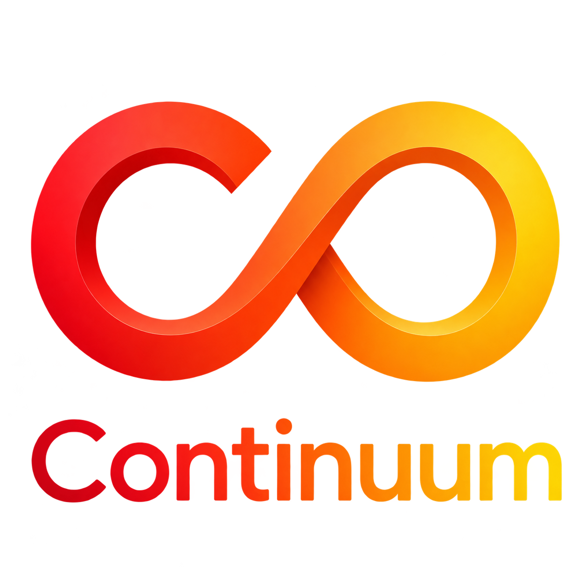
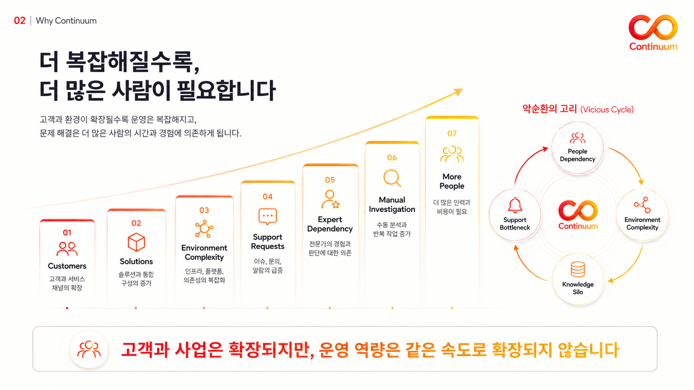
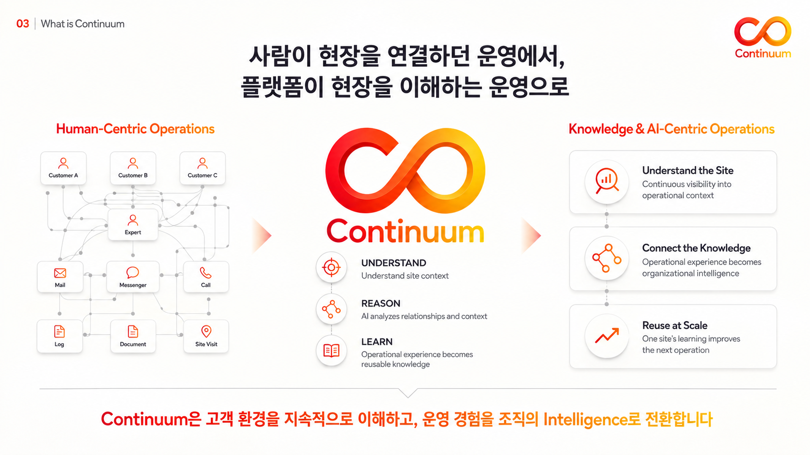
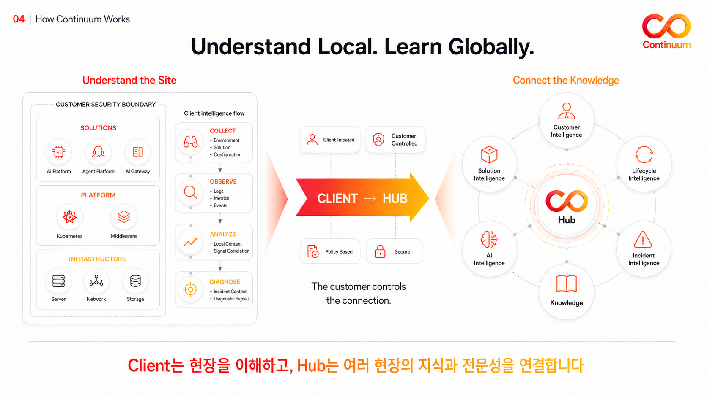
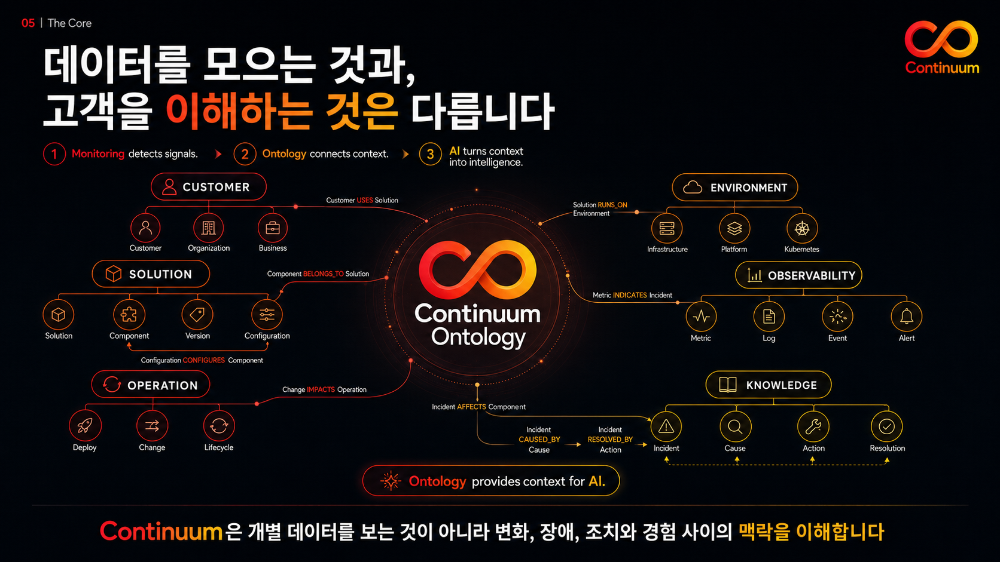
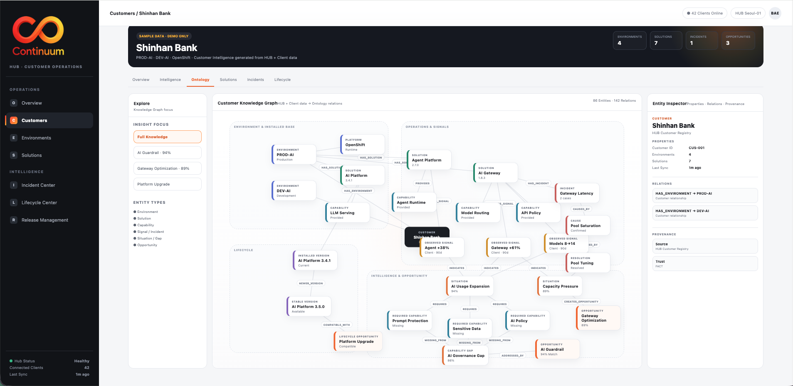
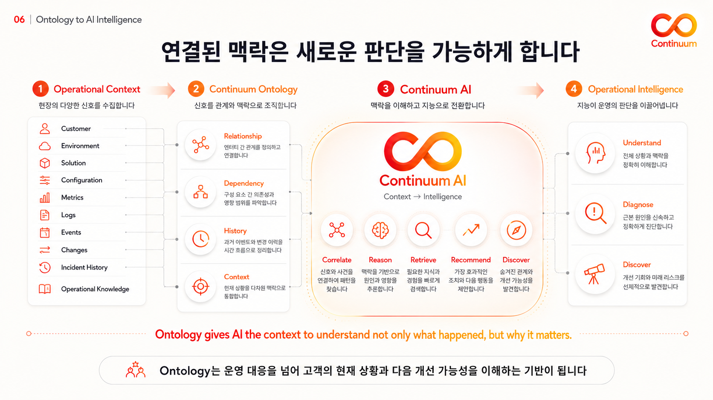
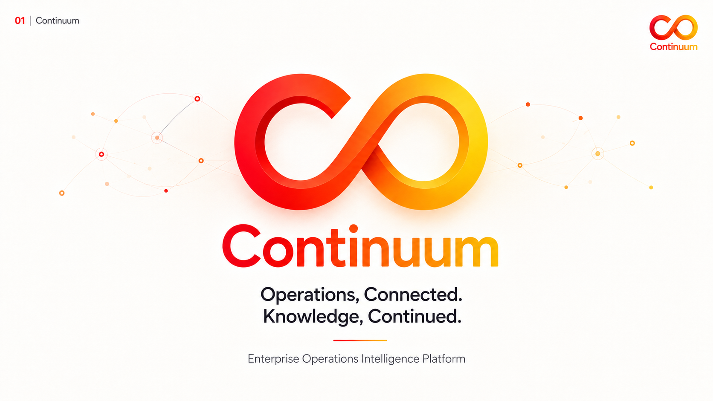

<p align="center">
  
</p>

<p align="center">
  <strong>Operations, Connected. Knowledge, Continued.</strong><br>
  폐쇄·이질적인 Enterprise IT 환경을 이해하고,<br>
  운영 경험을 조직의 Intelligence로 전환하는 플랫폼
</p>

---

**Continuum**은 고객 환경 내부의 AI Client와 중앙 Solution Hub를 연결하여 환경·솔루션·장애·변경의 맥락을 지속적으로 이해하고, 재사용 가능한 운영 지식으로 전환합니다.

고객이 통제하는 안전한 연결, 현장 내부의 자율적인 분석, 여러 현장의 경험을 연결하는 Operational Ontology를 통해 사람과 현장 방문에 의존하던 Enterprise 운영을 지식과 AI 중심의 운영으로 바꿉니다.

> **Understand Local. Learn Globally.**  
> Client는 현장을 이해하고, Hub는 여러 현장의 지식과 전문성을 연결합니다.

## Live Pilot

설명보다 먼저 Continuum의 실제 사용자 흐름을 경험해 보세요. 별도의 설치나 로그인 없이 GitHub Pages에서 바로 실행할 수 있습니다.

<p align="center">
  <a href="https://buildupcommon.github.io/continuum/"><strong>Continuum Pilot 시작하기 →</strong></a>
</p>

|  | **Continuum Client** | **Continuum Hub** |
| --- | --- | --- |
| **사용자** | 고객 현장 운영 담당자 | 본사·솔루션 운영 담당자 |
| **경험** | 환경과 솔루션을 파악하고 Incident부터 Lifecycle까지 관리 | 여러 고객·환경·솔루션과 Operational Knowledge를 통합 탐색 |
| **Live Demo** | [Client Pilot 바로 열기 →](https://buildupcommon.github.io/continuum/prototypes/client/) | [Hub Pilot 바로 열기 →](https://buildupcommon.github.io/continuum/prototypes/hub/) |

> **Sample Data · Demo Only** — Pilot의 고객명과 운영 데이터는 제품 경험을 설명하기 위한 샘플입니다.

## Why Continuum

고객과 사업은 빠르게 확장되지만, 사람과 전문가 경험에 의존하는 운영 역량은 같은 속도로 확장되지 않습니다.

[](docs/images/product-introduction/02-why-continuum.png)

Enterprise 운영 현장에서는 다음 문제가 반복됩니다.

- **People Dependency** — 고객과 솔루션이 늘어날수록 더 많은 현장 인력과 전문가가 필요합니다.
- **Environment Complexity** — Multi-Cloud, On-Premise, Kubernetes와 고객별 보안 정책이 복잡하게 혼재합니다.
- **Knowledge Silo** — 장애와 조치 경험이 티켓, 메일, 메신저와 개인의 기억에 파편화됩니다.
- **Support Bottleneck** — 소수 전문가가 환경 파악과 반복 지원에 시간을 소모합니다.

## What is Continuum

Continuum은 사람이 현장을 연결하던 운영을, 플랫폼이 현장을 지속적으로 이해하는 운영으로 전환합니다.

[](docs/images/product-introduction/03-what-is-continuum.png)

| 원칙 | 역할 |
| --- | --- |
| **Understand** | 고객 환경과 솔루션, 운영 상태와 현장 맥락을 이해합니다. |
| **Reason** | 데이터 사이의 관계와 이력을 바탕으로 원인과 영향도를 추론합니다. |
| **Learn** | 실제 운영 경험을 조직이 재사용할 수 있는 지식으로 전환합니다. |

한 현장의 학습은 그 현장에만 머물지 않습니다. 검증된 운영 경험은 Hub의 지식으로 축적되고, 다음 현장의 더 빠르고 정확한 판단을 돕습니다.

## How Continuum Works

Continuum은 고객 보안 경계 안에서 동작하는 **Client**와 여러 현장의 지식 및 솔루션을 연결하는 **Hub**로 구성됩니다.

[](docs/images/product-introduction/04-how-continuum-works.png)

### Continuum Client

고객 환경 내부에서 현장을 이해하는 AI Agent입니다.

- 서버, 네트워크, 스토리지, Kubernetes와 설치 솔루션 인벤토리 수집
- 로그, 메트릭, 이벤트와 설정 정보의 관찰 및 정규화
- 솔루션 토폴로지, 연관성 및 변경 영향도 분석
- Incident 발생 시 관련 맥락과 진단 신호 자동 구성
- 제한된 네트워크 환경에서도 가능한 로컬 분석
- 승인된 정책 범위 안에서 Update와 Rollback 수행

### Continuum Hub

다수 고객 환경의 지식과 솔루션 전문성을 연결하는 중앙 플랫폼입니다.

- 고객, 환경, 솔루션과 버전 정보의 통합 관리
- SK AX 및 BP Solution Catalog와 호환성·정책 관리
- Incident, Lifecycle, Release 이력의 통합 가시성
- 현장 경험을 연결하는 Operational Knowledge 축적
- 유사 사례 검색, 원인 후보와 조치 가이드를 위한 AI Intelligence
- 여러 고객 환경의 운영 현황과 지원 병목 모니터링

### Customer-controlled Connection

Client와 Hub의 연결은 고객 환경의 통제권을 우선합니다.

- **Client-initiated** — Client가 필요한 시점에 연결을 시작합니다.
- **Customer-controlled** — 고객이 수집·전송·실행 범위를 통제합니다.
- **Policy-based** — 승인된 정책과 버전에 따라 동작합니다.
- **Secure by design** — 읽기 전용을 기본으로 제한된 작업만 수행합니다.

## The Core — Continuum Ontology

모니터링은 신호를 발견합니다. Continuum Ontology는 그 신호가 어떤 고객·환경·솔루션·변경과 연결되어 있으며, 운영에 어떤 의미를 가지는지 설명합니다.

[](docs/images/product-introduction/05-continuum-ontology.png)

| 영역 | 연결되는 맥락 |
| --- | --- |
| **Customer** | 고객, 조직과 비즈니스 |
| **Environment** | 인프라, 플랫폼과 Kubernetes |
| **Solution** | 솔루션, 컴포넌트, 버전과 설정 |
| **Observability** | 메트릭, 로그, 이벤트와 알림 |
| **Operation** | 배포, 변경과 Lifecycle |
| **Knowledge** | Incident, 원인, 조치와 해결 결과 |

이 관계 모델을 통해 Continuum은 개별 데이터를 나열하는 데 그치지 않고, 변화와 장애, 조치와 경험 사이의 **맥락**을 이해합니다.

## Ontology in Product

아래 화면은 데모 데이터를 기반으로 고객, 환경, 솔루션, Incident, 원인, 조치와 개선 기회를 하나의 Knowledge Graph에서 탐색하는 Continuum Hub의 Operational Ontology 화면입니다.

[](docs/images/operational-ontology.png)

> **Sample Data · Demo Only** — 화면의 고객명과 데이터는 제품 경험을 설명하기 위한 데모 용도입니다.

Ontology 화면에서는 다음 관계를 하나의 맥락 안에서 탐색할 수 있습니다.

- 고객별 운영 환경과 설치 솔루션
- 솔루션, 플랫폼과 Capability의 의존성
- 관측 신호, Incident와 원인의 인과관계
- 해결 조치와 Lifecycle 변화
- 필요한 Capability와 개선 기회
- 운영 이슈에서 발견된 후속 Opportunity

## From Ontology to AI Intelligence

Ontology는 AI가 단순히 “무슨 일이 발생했는지”를 넘어 “왜 중요한지”를 이해할 수 있는 맥락을 제공합니다.

[](docs/images/product-introduction/06-ontology-to-ai-intelligence.png)

1. **Operational Context** — 고객, 환경, 솔루션, 설정, 관측 신호와 변경 이력을 수집합니다.
2. **Continuum Ontology** — 관계, 의존성, 이력과 현재 상황을 연결된 맥락으로 구성합니다.
3. **Continuum AI** — 사건을 연결하고 원인을 추론하며 필요한 지식과 경험을 검색합니다.
4. **Operational Intelligence** — 근본 원인, 조치 방향, 개선 기회와 미래 리스크를 제시합니다.

Continuum AI는 연결된 맥락을 기반으로 다음 역할을 수행합니다.

- **Correlate** — 관련 신호와 사건을 연결합니다.
- **Reason** — 관계와 이력을 바탕으로 원인과 영향을 추론합니다.
- **Retrieve** — 현재 상황에 필요한 지식과 경험을 찾습니다.
- **Recommend** — 효과적인 조치와 다음 행동을 제안합니다.
- **Discover** — 숨겨진 관계, 개선 기회와 잠재 리스크를 발견합니다.

## Knowledge Flywheel

```text
현장 이해
  → 이상 징후와 Incident 발견
  → 관계·원인·영향도 분석
  → 조치와 결과 기록
  → Hub의 운영 지식으로 축적
  → 다른 고객 환경에서 재사용
  → 더 정확한 분석과 판단
```

> **한 현장의 학습이 다음 현장의 운영을 개선합니다.**

## Key Differentiators

- **Local Autonomy** — 폐쇄망 내부에서도 현장을 분석하는 자율 AI Client
- **Customer-controlled** — 고객이 연결과 데이터, 실행 범위를 통제하는 구조
- **Context-aware** — 단순 관제를 넘어 관계, 이력과 영향도를 이해하는 Ontology
- **Knowledge at Scale** — 현장의 운영 경험을 조직 전체가 재사용하는 지식으로 전환
- **Solution Ecosystem** — SK AX와 BP 솔루션을 하나의 카탈로그와 관계 모델로 관리
- **Continuous Lifecycle** — 구축, 운영, 고도화와 AI Transformation을 연속적으로 연결

## Expected Impact

- 반복적인 현장 파악과 수작업 진단 감소
- 전문가 지원 병목과 방문 의존성 완화
- 구축에서 SM 전환까지의 인수인계 효율 향상
- 고객별로 달라지는 운영 대응의 표준화
- 개인에게 머물던 운영 경험의 조직 자산화
- 솔루션 재사용성과 Lifecycle 관리 효율 향상
- 장애 대응을 넘어 개선과 후속 사업 기회 발견

## Product Introduction Deck

6페이지 제품소개서를 한 번에 확인하거나 내려받을 수 있습니다.

[**Continuum 제품소개서 PDF 보기 →**](output/pdf/continuum-6-page-brochure.pdf)

<details>
<summary><strong>제품소개서 전체 보기</strong></summary>

### 01. Continuum

[](docs/images/product-introduction/01-continuum.png)

### 02. Why Continuum

[](docs/images/product-introduction/02-why-continuum.png)

### 03. What is Continuum

[](docs/images/product-introduction/03-what-is-continuum.png)

### 04. How Continuum Works

[](docs/images/product-introduction/04-how-continuum-works.png)

### 05. The Core — Continuum Ontology

[](docs/images/product-introduction/05-continuum-ontology.png)

### 06. Ontology to AI Intelligence

[](docs/images/product-introduction/06-ontology-to-ai-intelligence.png)

</details>

---

<p align="center">
  <strong>Continuum</strong><br>
  Operations, Connected. Knowledge, Continued.
</p>
